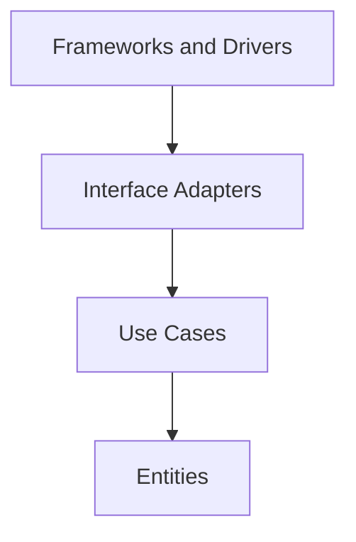

# Core Architecture Spec

本文件定義本 project 的架構開發原則，適用於所有開發人員與 AI agent。

本 project 採用 Clean Architecture 作為主要架構原則。實作時必須讓核心業務規則獨立於 framework、database、UI、外部服務與部署細節。

本文整理自 [The Clean Architecture](https://blog.cleancoder.com/uncle-bob/2012/08/13/the-clean-architecture.html)。

## 核心目標

本 project 的設計必須滿足以下目標：

- Separation of concerns：不同責任必須分層，業務規則、應用流程、轉接器與外部工具不得混在一起。
- Independent of frameworks：framework 是工具，不是核心架構的中心。
- Testable：business rule 與 use case 必須能在不啟動 DB、HTTP server、message broker、UI 或外部服務的情況下測試。
- Independent of UI：介面形式可以替換，不得影響核心業務規則。
- Independent of database：資料庫與 ORM 是外層細節，不得污染內層模型與 use case。
- Independent of external agencies：核心邏輯不應知道第三方 API、雲端服務、作業系統或傳輸協定的細節。

## Dependency Rule

Clean Architecture 最重要的規則是 Dependency Rule：source code dependencies 只能指向內層。



依賴方向代表：

- 外層可以知道內層。
- 內層不得 import、引用、命名或依賴外層。
- 內層不得接受外層 framework 的資料型別，例如 HTTP request、ORM model、SQL row、queue message、cloud SDK object。
- 外層變更不應迫使內層業務規則變更。

若流程控制需要由內層呼叫外層能力，必須使用依賴反轉：內層定義需要的 port/interface，外層提供實作。

## 建議層次

實際目錄名稱可依專案演進調整，但責任邊界必須清楚。

### Entities

Entities 是最內層，負責核心商業概念與跨 use case 的穩定規則。

Entities 可以包含：

- Domain type、value object、aggregate。
- 不依賴外部系統即可執行的業務規則。
- 業務 invariant 與狀態轉換。

Entities 不得包含：

- Database schema、ORM tag、SQL row mapping。
- HTTP、gRPC、GraphQL、CLI 或 queue payload。
- 外部 SDK 型別。
- Framework lifecycle 或部署設定。

### Use Cases

Use cases 描述應用程式特定的業務流程，負責協調 entities 與 ports。

Use cases 可以包含：

- Application service。
- Command/query handler。
- Transaction boundary 的抽象需求。
- Repository、publisher、clock、ID generator 等 port/interface 定義。

Use cases 不得包含：

- SQL、HTTP routing、controller、framework middleware。
- 具體資料庫 client 或外部 SDK 呼叫。
- UI response format 或傳輸協定格式。

### Interface Adapters

Interface adapters 負責轉換內層與外層之間的資料格式。

Interface adapters 可以包含：

- Controller、presenter、handler adapter。
- Repository implementation。
- DTO 與 mapper。
- 將 HTTP request、database row、queue message 轉成 use case input 的轉換邏輯。

Interface adapters 必須避免把外層格式直接傳入 use case 或 entity。

### Frameworks and Drivers

Frameworks and drivers 是最外層，負責具體工具與執行環境。

這一層可以包含：

- Web framework、router、server bootstrap。
- Database driver、migration tool、ORM setup。
- Message broker、cache、cloud SDK。
- Config loading、logging backend、metrics exporter。

外層程式碼應保持薄，主要負責 wiring、configuration 與 glue code。

## 資料穿越邊界

跨層傳遞資料時，資料格式必須以內層最容易理解與維護的形式為準。

- 進入 use case 前，外部 request、database row、message payload 必須先轉成內層 input model 或簡單 value。
- Use case 回傳給外層時，應回傳內層 result model 或簡單 value，再由 adapter 轉成 HTTP response、database update、message event。
- 不得把外部 framework model、ORM entity、SQL row 或 third-party SDK response 傳入 entities/use cases。
- 跨邊界資料應使用清楚、穩定、低耦合的 struct、primitive value 或明確的 domain type。

```go
// Good: use case receives an input model defined for the application rule.
type CreateOrderInput struct {
	CustomerID string
	Items      []OrderItemInput
}

// Bad: use case depends on transport details.
func CreateOrder(r *http.Request) error
```

## 介面與依賴反轉

Interface 是用來保護內層規則，不是用來裝飾每個 struct。

- Interface 應由使用端定義，描述 use case 真正需要的能力。
- Interface 應保持小而明確，避免把外部工具完整 API 洩漏進內層。
- 外層實作內層定義的 port，例如 repository、transaction manager、event publisher。
- 不為了「未來可能替換」建立空泛 abstraction；只有在跨邊界或測試隔離需要時才引入。

```go
// Good: use case owns the persistence need.
type OrderRepository interface {
	Save(ctx context.Context, order *Order) error
}
```

## 錯誤與交易邊界

- Use case 應回傳具有業務語意的 error，避免暴露資料庫、HTTP 或外部 SDK 的原始錯誤型別。
- Adapter 可以包裝外部錯誤，並轉換成 use case 能理解的錯誤語意。
- Transaction boundary 屬於 use case 的需求，但具體 transaction implementation 屬於外層。
- 不得讓 entity 依賴 transaction、database session 或 request context。

## 測試要求

- Entities 必須能用純 unit test 驗證，不需要 mock 外部系統。
- Use cases 必須能以 fake 或 in-memory port implementation 測試，不需要啟動 DB、HTTP server、queue 或外部 API。
- Interface adapters 應測試資料轉換、錯誤映射與 framework integration。
- Frameworks and drivers 測試應集中在 wiring 與 integration，不應重測內層業務規則。
- 若某段核心邏輯難以測試，通常代表依賴方向或責任邊界需要調整。

## 禁止事項

以下做法違反本 project 的 Clean Architecture 原則：

- Entity 或 use case import infrastructure、adapter、driver、web framework、ORM、cloud SDK。
- Use case 直接讀寫 SQL、呼叫 HTTP client、操作 queue client 或依賴具體 cache client。
- 內層函式接受 `*http.Request`、ORM model、SQL row、message payload、third-party SDK response。
- 在 entity 放入 JSON/API/DB tag，除非該 tag 是內層穩定資料契約的一部分且有文件說明。
- 為了共用方便，把跨層資料結構放到 `common`、`util`、`model` 等模糊 package。
- 讓外部 framework 的錯誤碼、狀態碼或資料格式成為業務規則的一部分。
- 因為測試困難而跳過測試，而不是修正架構邊界。

## Agent 執行規則

AI agent 新增或修改本 project 程式碼時必須遵守以下規則：

- 修改前先判斷目標程式碼屬於 entity、use case、interface adapter 或 framework/driver。
- 新增 import 時檢查依賴方向；內層不得 import 外層。
- 新增跨層資料傳遞時，確認資料格式由內層定義或對內層友善。
- 新增外部工具、framework、SDK、DB 或 transport 整合時，只能放在外層，並透過 port/interface 連接內層。
- 修改 use case 或 entity 時，必須保持不需要啟動外部系統即可測試。
- 若需要新增 interface，先確認它是否由使用端需求驅動，而不是為了包裝具體實作。
- 修改 architecture contract、資料邊界或依賴方向時，必須同步更新文件與測試。
