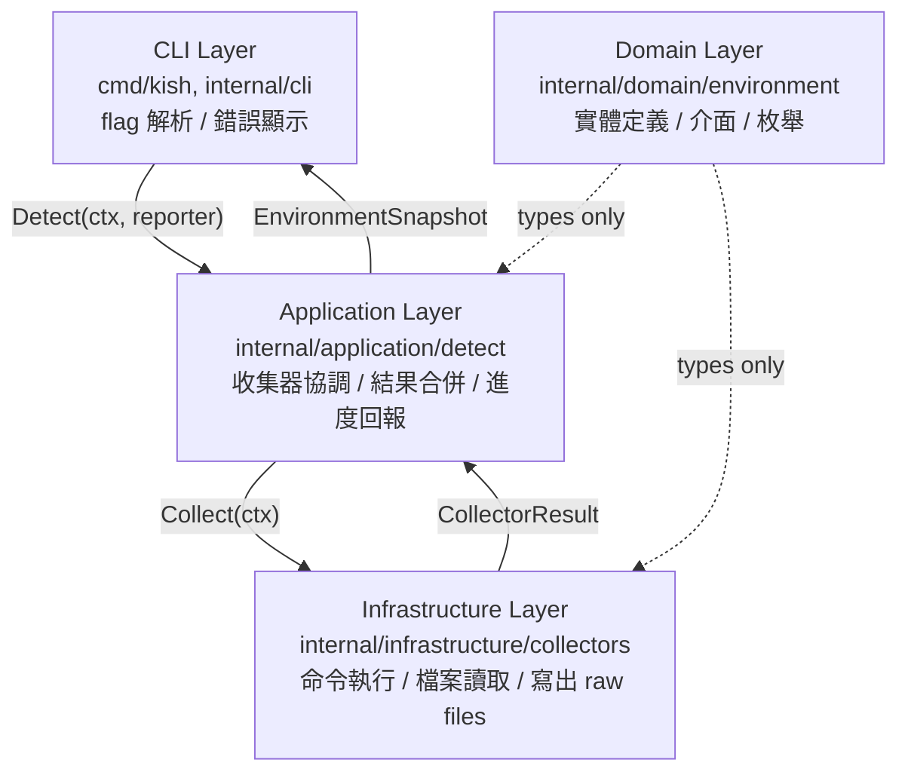

# kish detect v1 Implementation Record

**Date:** 2026-04-29  
**Scope:** `kish detect` 命令從零到可用的完整實作，涵蓋三個迭代階段。

---

## 背景與目標

`kish detect` 是 kish CLI 的第一個子命令，用於偵測當前執行環境並產生符合 `environment-snapshot/v1` schema 的 JSON 快照。快照供後續上傳至後端、比對測試案例環境、及問題排查使用。

**明確排除於 v1 範圍之外：**
- 上傳模式（upload mode）
- TestCase 建立
- 後端 API 呼叫
- MongoDB、benchmark 結果解析、Dashboard、Campaign、Agent 功能

---

## 架構決策

### 分層結構

採用輕量 Clean Architecture，四層明確分離：



**關鍵約束：**
- 業務規則（如環境類型推斷）不得放在 handler 或 infrastructure 層
- Domain 層不得依賴 Infrastructure

### 模組結構

```text
cmd/kish/main.go

internal/
  cli/
    root.go
    detect.go

  domain/environment/
    snapshot.go      ← EnvironmentSnapshot
    types.go         ← 枚舉常數
    package.go       ← PackageSet, Package
    collector.go     ← CollectorResult, CollectorReport, Collector interface
    device.go        ← Devices, GPUDevice

  application/detect/
    service.go       ← DetectionService.Detect()
    registry.go      ← DefaultCollectors()
    reporter.go      ← Reporter interface + 實作

  infrastructure/
    command/runner.go
    collectors/
      linux_system.go
      container.go
      system_packages.go
      rocm.go
      gpu.go
      python_packages.go
      rawfile.go

Makefile
```

---

## 核心設計決策

### 1. 術語對齊（v1 初始決策）

在實作前先更新 `docs/architecture/glossaries/environment.md`，確保代碼術語與文件一致：

| 舊術語 | 新術語 | 說明 |
|--------|--------|------|
| `role` | `scope` | 環境角色改稱 scope |
| `physical_host` | `host` | 簡化類型名稱 |
| `vm` | `virtual_machine` | 完整名稱 |
| — | `bare_metal` | 新增裸機類型 |

### 2. Collector 介面設計

```go
type Collector interface {
    Name() string
    Collect(ctx context.Context) CollectorResult
}
```

**決策：** Collector 接收 `context.Context` 以支援 timeout 和取消，但不互相依賴。收集失敗不中止整體流程，只記錄於 `CollectorReport`。

### 3. CommandRunner 抽象

`command.Runner` 介面封裝 `os/exec`，包含 `LookPath` 和 `Run` 兩個方法，每次呼叫加上 5 秒 timeout。此抽象使 Collector 可在測試中注入 `FakeRunner`，無需真實執行外部命令。

### 4. 環境類型推斷

類型推斷邏輯放在 Application 層（`service.go`），不在 collector 或 CLI：

```
data["container.detected"] == "true"  →  TypeContainer
否則                                   →  TypeHost
```

### 5. Reporter 介面（v0.1 決策）

進度輸出透過 `Reporter` 介面隔離，不直接寫入 stdout：

```go
type Reporter interface {
    CollectorStarted(name string)
    CollectorFinished(name string, status environment.CollectorStatus)
    SnapshotWritten(path string)
}
```

- `StdoutReporter`：預設，輸出帶 `[detect]` 前綴的進度
- `NoopReporter`：`--quiet` 旗標時使用

`SnapshotWritten` 在 CLI 層呼叫（因路徑由 CLI 決定，不由 service 決定）。

### 6. GPU 結構化輸出（v0.1 決策）

GPU 資訊從逗號分隔字串（`gpu.models`）改為結構化 `devices.gpus[]`：

```go
type GPUDevice struct {
    Index  int    `json:"index"`
    Model  string `json:"model,omitempty"`
    Vendor string `json:"vendor,omitempty"`
    ID     string `json:"id,omitempty"`
}
```

**理由：** 結構化資料支援後端索引、比對與查詢；字串格式不可靠且難以解析。`data["gpu.count"]` 和 `data["gpu.vendor"]` 保留作為快速查詢鍵。

### 7. RPM 解析強化（v0.1 決策）

RPM 從 `rpm -qa` 改為帶 queryformat 的格式化輸出：

```bash
rpm -qa --queryformat '%{NAME}\t%{VERSION}\t%{RELEASE}\t%{ARCH}\n'
```

**理由：** 原始 `rpm -qa` 輸出格式不固定；queryformat 產生 tab 分隔的結構化行，可靠解析 name / version / release / architecture 四欄。

### 8. Python editable 套件位置（v0.1 決策）

新增 `pip list --format=json --editable` 步驟，提取 editable 安裝的本地路徑，合併至 `Package.Location`。

pip 不同版本使用不同欄位名（`editable_project_location` 或 `location`），兩者皆正規化為同一個 `Location` 欄位。editable 步驟失敗只升為 `partial`，不影響主套件清單。

### 9. 原始輸出改為外部檔案（v0.1 → raw file 迭代決策）

**演進過程：**
- v1 初始：`PackageSet.RawText` 預設存原始輸出
- v0.1：service 層在合併時清空 `RawText`，結構化資料為主
- raw file 迭代：移除 `RawText` 欄位，改為 `RawFile`

**最終決策：** Collector 執行命令後，將原始 stdout 寫入獨立的 `.txt` 檔，僅在 `PackageSet.RawFile` 記錄檔名：

```
PackageSet.raw_file = "snapshot_dpkglist_20260429T120000Z.txt"
```

**理由：**
- 套件清單可達數萬行，嵌入 JSON 使快照過大
- 外部檔案保留可追溯性，又不污染結構化 JSON
- `RawFile` 與 JSON 置於同一目錄，路徑為相對路徑

Raw file 命名格式：`snapshot_<collector>_<timestamp>.txt`（timestamp 格式：`20060102T150405Z`）

`outputDir` 由 CLI 根據 `--output` 旗標決定，透過 `DefaultCollectors(runner, outputDir)` 傳入，只有需要寫檔的 collector 才接收此參數。

### 10. Package.Raw 欄位移除（後續決策）

個別 package item 中的 `Raw` 欄位（原始行）移除，不出現在 JSON 輸出。

**理由：** 原始行已由 `PackageSet.raw_file` 覆蓋，package item 應只含結構化欄位。malformed 行仍以 `Name` 欄位保留，不額外附加原始文字。

**最終 Package schema：**

```text
Package
├── name          (required)
├── version
├── architecture  (system packages)
├── release       (RPM only)
└── location      (Python editable only)
```

### 11. --output 可選與預設檔名（v0.1 決策）

`--output` 改為可選，省略時自動產生：

```
env_{sanitized_hostname}_{yyyymmddHHMMSS}.json
```

hostname 來源優先序：`snapshot.Data["hostname"]` → `os.Hostname()` → `"unknown-host"`。hostname 只保留 `[a-zA-Z0-9._-]`，其餘替換為底線。

---

## 六個 Collector 設計摘要

| Collector | 資料來源 | 主要輸出 |
|-----------|---------|---------|
| `linux_system` | `/etc/os-release`、`uname`、`hostname` | `data` 中的 OS 資訊 |
| `container` | `/.dockerenv`、`/proc/1/cgroup` | `container.detected`；cgroup 原始內容進 `raw` |
| `system_packages` | `dpkg -l` 或 `rpm -qa --queryformat` | `package_sets[system]` + raw file |
| `rocm` | `/opt/rocm/.info/version`、`rocm-smi`、`rocminfo` | ROCm 版本資訊 |
| `gpu` | `rocm-smi`（優先）、`lspci`（fallback） | `devices.gpus[]` 結構化裝置 |
| `python_packages` | `python3 -m pip list`、`pip list --editable` | `package_sets[python]` + raw file |

**共同設計原則：**
- 工具不存在 → `StatusSkipped`（不算失敗）
- 指令失敗 → `StatusFailed`（不中止整體流程）
- 部分解析失敗 → `StatusPartial` + warnings
- 無 GPU 偵測到 → 仍 `StatusSuccess`

---

## CLI 旗標

| 旗標 | 預設值 | 說明 |
|------|--------|------|
| `--output`/`-o` | 自動產生 | 快照 JSON 輸出路徑 |
| `--pretty` | false | 輸出縮排格式 JSON |
| `--quiet` | false | 不輸出進度至 stdout |

---

## 建置

`Makefile` 於 repo 根目錄提供標準目標：

```makefile
make build   # 產生 build/kish（可跨平台，CGO_ENABLED=0）
make test    # go test ./...
make clean   # 移除 build/ 目錄
```

---

## 架構文件同步

每個迭代均先更新 `docs/architecture/glossaries/environment.md`，確保：
- 術語定義（scope、type 枚舉）與代碼一致
- PackageSet、Package schema 反映實際 JSON 輸出
- Collector 行為規範（status 定義、error handling 原則）已記錄
- 新概念（Devices、GPUDevice、raw_file）在文件中有對應章節
